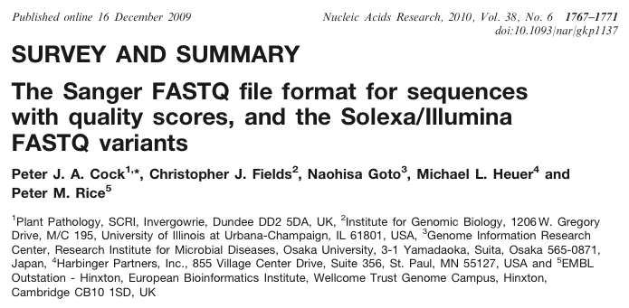
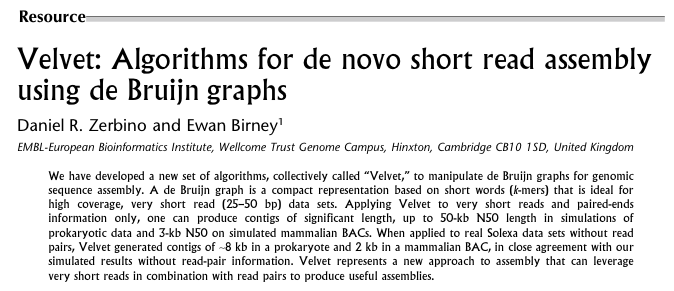
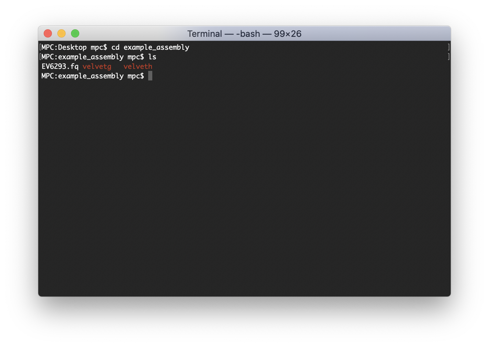
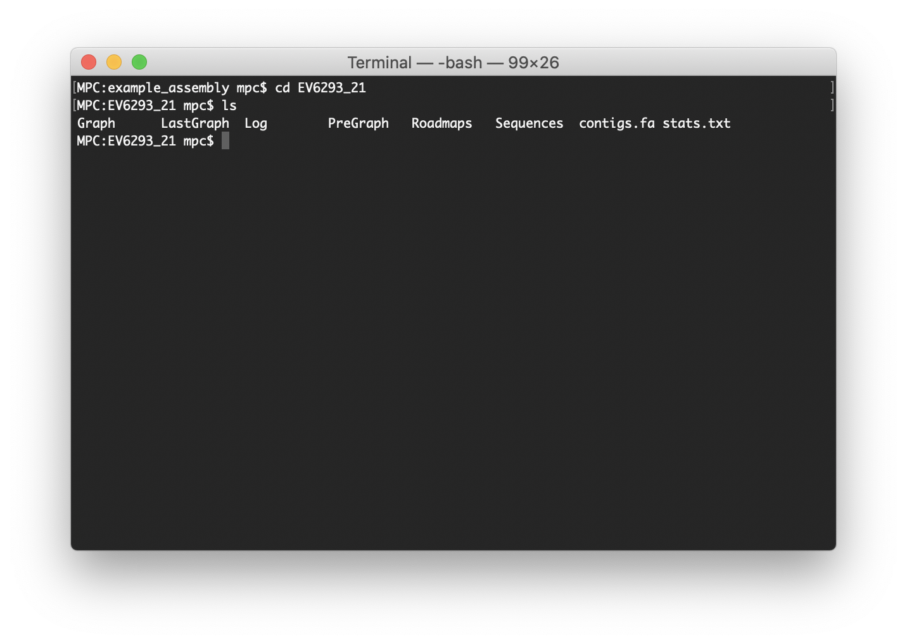
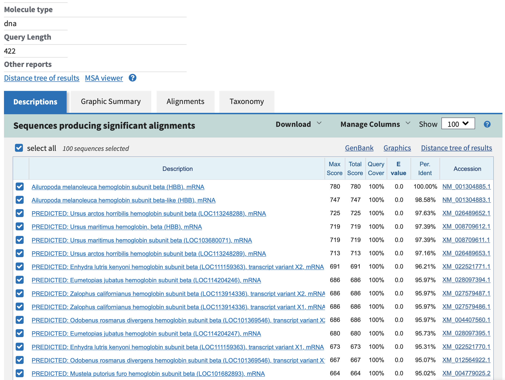

# *De Novo* Assembly of Short Read Sequences

[Prof Murray Cox](https://www.genomicus.com)<br>
School of Fundamental Sciences

**In this lab, you will gain experience in taking fragmentary next generation sequencing reads and joining them together to create complete genomic sequences.**


## Sections

[Background](#background)<br>
[UNIX Basics](#unix-basics)<br>
[Next Generation Sequences](#next-generation-sequences)<br>
[Assembly Software](#assembly-software)<br>
[Installing Velvet](#installing-velvet)<br>
[Assembly Example](#assembly-example)<br>
[What Should I Do Now?](#what-should-i-do-now)<br>
[Pseudocode and Code](#pseudocode-and-code)<br>
[Research Report](#research-report)<br>
[Grading Criteria](#grading-criteria)<br>
[Due Date](#due-date)


## Background

Sequencing costs have reduced by orders of magnitude in recent years. The first human genome took years to produce, cost billions of dollars and required the collaborative effort of thousands of scientists. Not much more than ten years later, one research scientist can sequence a human genome in a few days for a little over a thousand dollars.

As sequencing costs have dropped, a large number of organisms have been sequenced. Some of these species are commercially important (cows and corn), others are medically relevant (HIV and hepatitis), while yet others are interesting for less pragmatic reasons (pandas and poodles). Access to genome sequences is now seen as default baseline information for many research questions, industry goals and government policy decisions. Consequently, these sequences technologies are being adopted rapidly. You can expect to encounter next generation sequence data in many jobs – regardless of whether you go into academia, industry or government – or just as you go about life as a private individual.

In this module, you will learn how to assemble a dataset of next generation short-read sequences. Your purpose is to act as a forensic scientist and determine which organism and gene a sample comes from.


---

## UNIX Basics

Assembling short reads is tricky – it is mathematically complex and computationally intensive. For these reasons, assembly is typically performed on large UNIX clusters using command line programs. This is the sort of work environment we will be using today. 

You have already covered basic UNIX commands in module 1. If you are comfortable with the UNIX command line, continue straight on below with the tasks for module 5. If you prefer to take a quick refresher on some UNIX commands that may be useful for this lab, check out the short tutorial [here](docs/unix.html).


---

## Next Generation Sequences

Sequences from next generation technologies come in a lot of different flavors. For this lab, we will be using sequences generated on the [Illumina platform](http://www.illumina.com/applications/sequencing.html), one of the dominant technologies in use today.

Next generation sequences are usually provided in a format called [FASTQ](https://en.wikipedia.org/wiki/FASTQ_format), where the *Q* stands for *quality*.  The entry for a single read would typically look something like this:

```
@EV6293_1
CCAAGGTGCATCTGACTGGTGAGGAGAAGGCTGCCGTCACCGGCCTGTGG
+
C1C(=FDFH<DHHJJJJJJ;JG?I)IJHF<IJJHIIHJBJIIJEJICIJ4
```

Each sequence entry consists of four lines. The first line always starts with ‘@’ and is followed by a unique read identifier (here, *EV6293_1*). The second line lists the actual DNA (or RNA) sequence. The third line always starts with ‘+’, optionally followed by the unique identifier again. The fourth line lists the quality of each base along the sequence in a fairly esoteric ASCII encoding. You can read more about how this quality information is encoded in this paper:

Cock PJA, CJ Fields, N Goto, ML Heuer and PM Rice. 2010. [The Sanger FASTQ file format for sequences with quality scores, and the Solexa/Illumina FASTQ variants](https://doi.org/10.1093/nar/gkp1137). *Nucleic Acids Research* 38:1767--1771.



FASTQ files are typically large. Standard Illumina runs produce up to eight lanes of data, each with >300 million different sequence reads. Files for just one of these lanes would usually exceed 50 gigabytes – more than twice the size of the extended ‘Lord of the Rings’ DVD box set. Data amounts, and hence file sizes, are getting bigger all the time.

Assembling datasets this large is a major undertaking. You will be working with much smaller datasets in this lab, but this lab exercise purposely uses real sequence data from real research projects. The assemblies you perform below are identical to those undertaken in genuine research settings. The only difference is that the file sizes are smaller and so the assemblies are (much) quicker to run.


---

## Assembly Software

There are a lot of programs that perform *de novo* sequence assembly – joining up short reads into a single, longer sequence. New programs are being developed all the time.  The software we're going to use here is an old standard, [Velvet](https://www.ebi.ac.uk/~zerbino/velvet/).

Daniel Zerbino and Ewen Birney wrote Velvet at the [European Bioinformatics Institute](https://www.ebi.ac.uk) in Cambridge, and published a description of its algorithm in 2008:

Zerbino DR and E Birney. 2008. [Velvet: Algorithms for de novo short read assembly using de Bruijn graphs](https://doi.org/10.1101/gr.074492.107). *Genome Research* 18:821--829.



Like many scientific programs, Velvet is open source – which means you can download and read the code if you want to. Velvet can be freely downloaded [from the web](https://www.ebi.ac.uk/~zerbino/velvet/).

Velvet is actually a cover name for two different programs that need to be run sequentially. These programs are called ```velveth``` and ```velvetg```.

A typical assembly job would look something like this:

```
velveth assembly_directory_21 21 -fastq -short input_file.fastq
velvetg assembly_directory_21
```

Let's break this down into pieces.

The output files that Velvet makes are placed in a new directory called *assembly_directory_21*, the k-mer size (we’ll talk about this in the lectures) is 21, the input format is FASTQ, the data are short reads (e.g., the Illumina technology or similar), and the input file that contains the sequence data is called ```input_file.fastq```. Of course, the names of these files and directories will need to be changed to whatever is appropriate for your study!

When you think about assembling reads, you probably automatically bring to mind so-called overlap methods.  In other words, you overlap reads until you find matches, and then you join those overlapped reads together.  Something like this:

```
Read 1:    GGCTAGAGGCTAGCTTCAATGGGCGAAAGACCC
Read 2:                GCTTCAATGGGCGAAAGACCCGAGAGAGCTGGCT
Assembly:  GGCTAGAGGCTAGCTTCAATGGGCGAAAGACCCGAGAGAGCTGGCT
```

While intuitive this kind of approach does not work well with large short-read datasets in practice.  Velvet instead uses a branch of mathematics concerned with networks (de Bruijn graph assembly algorithms).  A key feature of this assembly approach is the *k*-mer, a unique sequence of length *k*.  *k*-mers are sometimes called *word sizes*.  In Velvet, the *k*-mer is the most important free parameter, and can be any odd number from 3 to the length of the read.

We will cover de Bruijn graph assembly more fully in the lectures, but you should also learn more about this approach in the following papers.  I strongly suggest you read some or all of them.  *Understanding de Bruijn assembly is crucial to completing this lab*.

Compeau PEC, PA Pevzner and G Tesler. 2013. [How to apply de Bruijn graphs to genome assembly](https://doi.org/10.1038/nbt.2023). *Nature Biotechnology* 29:987-991.

Simpson JT and M Pop. 2015. [The theory and practice of genome sequence assembly](https://doi.org/10.1146/annurev-genom-090314-050032). *Annual Review of Genomics and Human Genetics* 16:153-172.

Zerbino, D. R. and E. Birney. 2008. [Velvet: Algorithms for de novo short read assembly using de Bruijn graphs](https://doi.org/10.1101/gr.074492.107). *Genome Research* 18:821--829.


---

## Installing Velvet

You will be using computers running macOS in this lab.  I have already compiled the two programs for you (i.e., ```velveth``` and ```velvetg```) and you can simply download them [here](code/macOS_10.15_binaries.zip).  

If you want to learn how to compile these programs from the original source code, or if you want to run Velvet on your own non-macOS computer, [check out the instructions here](docs/compilation.html).  Compiling programs isn't as hard as it first seems, and it is a very useful skill to know.


---

## Assembly Example

Below I list the steps needed to assemble a set of FASTQ sequences using Velvet. Note that you will be repeating this exercise on your own dataset later in the lab, so make sure you understand this section well.

First, make a new directory where you will perform all of your analyses.  You should use an informative name, but for this test example, we'll just use ```example_assembly```:

```
mkdir example_assembly
cd example_assembly
ls
```

Next, you need a dataset of short-read sequences to assemble. We'll use the example dataset [EV6293.fq](example/EV6293.fq). Move the example dataset file into your new directory. 

Take a look at the input reads:
```
head EV6293.fq
```

Pay particular attention to how long the input reads are. In this example file, the input reads are 50 nucleotides long:
```
@EV6293_1
CCAAGGTGCATCTGACTGGTGAGGAGAAGGCTGCCGTCACCGGCCTGTGG
+
C1C(=FDFH<DHHJJJJJJ;JG?I)IJHF<IJJHIIHJBJIIJEJICIJ4
@EV6293_2
GGGGTTGTTCATAACAGCATCAGGAGTGGACAGGTCCCCAAAGGAGTCAA
+
CC@FFED+AHHHHEJIJHIIFJJJJJJJIJHJGIGJDG.IJIJJGJHBH=
@EV6293_3
CCACCACCTTCTGATAGGCAGCCTGCACCTGAGGGGTGAACTCTTTGCCG
...
```

Now, you need to get the Velvet programs.  There are better ways to set them up so they can be used anywhere on your computer, but for now, let's simply copy-and-paste the program files ```velveth``` and ```velvetg``` into your directory.  As a reminder, you can download these programs [here](code/macOS_10.15_binaries.zip), or learn how to compile them for your own computer [here](docs/compilation.html).



We are now are ready to perform an assembly with a chosen *k*-mer value. Let’s start with a *k*-mer value of 21.  The two Velvet command lines you need to run (described above) are:

```
./velveth EV6293_21 21 -fastq -short EV6293.fq
./velvetg EV6293_21
```

These commands should complete within seconds, but for typical genome scale assemblies, they might take hours to days.  If these commands don't finish quickly, there's a problem.  The two most common errors are typos and missing files.  Check your command lines very carefully and also make sure that all the files you need are in your directory (read the steps above again).

Assuming the programs ran ok, it's time to look at the Velvet output.  Do this by moving into the assembly directory you created and see what files are in there:

```
cd EV6293_21
ls
```

You should have a number of files, including *Graph*, *LastGraph*, *Log*, *PreGraph*, *Roadmaps*, *Sequences*, *contigs.fa* and *stats.txt*.  Take a look at some of these files using the command ```cat``` or similar.



Although all of these files contain information, the main files needed for this lab are *stats.txt* and *contigs.fa*.

The *stats.txt* file contains most of the information we need about how well the assembly process worked. You should mostly use this file for the analyses you are asked to do below. For the example run, the *stats.txt* file should look something like this:

```
ID   lgth   out  in   …
1    329    0    0    …
```

This particular file only contains two lines: a header line and a single entry on the next row.  There will be (many) more lines when you use other assembly parameters instead.

The most helpful columns are the first and second. The first column lists the ID number of each assembled fragment, called a *contig* (here, this identifier is *1*).  The second column lists the length of each assembled contig (here, 329 nucleotides). 

For most datasets, you will see far more assembled contigs, and some of these contigs may be very small (even, in extreme cases, just 1 nucleotide long).

The actual assembled sequences – the *contigs* – are contained in the file *contigs.fa*. This is just a simple text file containing [FASTA](https://en.wikipedia.org/wiki/FASTA_format) sequence records. Each contig will look something like this:

```
>NODE_1_length_329_cov_16.844984
GTCCTCCAATCTTACCGAAGAACAAATTGCTGAATTCAAAGAAGCCTTTGCCCTCTTTGA
TAAAGATAACAATGGCTCTATCTCATCAAGTGAATTGGCCACTGTGATGAGGTCATTGGG
TCTTTCGCCCAGTGAAGCAGAAGTAAATGATTTGATGAACGAAATAGATGTTGATGGTAA
CCATCAAATCGAATTTAGTGAATTTTTGGCTCTGATGTCTCGTCAACTCAAATCAAATGA
CTCTGAACAAGAACTACTAGAAGCTTTTAAAGTATTCGATAAGAACGGTGATGGTTTAAT
CTCCGCCGCTGAGTTGAAACACGTGCTACCATCCATTGGTGAAAAATTG
```

As recorded in the *stats.txt* file, this contig has an ID number of 1 and is 329 nucleotides long. Since the input reads were only 40 nucleotides long, the assembly process has clearly worked – at least to some extent. But keep an eye out for poorly assembled contigs – say, contigs smaller than the input read size. These may appear in the *stats.txt* file and should be included in your analyses, but Velvet often excludes them from the *contigs.fa* file.

Finally, we want to find out what organism this sample originally came from and what gene the sequence represents. We will use [BLAST](https://blast.ncbi.nlm.nih.gov/Blast.cgi) and the [GenBank database](https://www.ncbi.nlm.nih.gov/genbank/) to find this out. 

At the [BLAST](https://blast.ncbi.nlm.nih.gov/Blast.cgi) website, choose *nucleotide blast*.

On the following page, paste your sequence into the box. Under ‘Database’, select ‘Others (nr etc.)’, or try a dedicated gene database, such as 'Reference RNA sequences (refseq_rna)'. Under ‘Optimize for’, select ‘Optimize for: Somewhat similar sequences (blastn)’. Feel free to play around with other options, such as *megablast* too. Finally, click the **BLAST** button.

After a little while, you should see a screen that looks something like this (the formatting changes regularly as the website is updated):



The red lines (top) represent good blast hits. You want to look for the best match to a gene or mRNA sequence, as opposed to an entire genome, chromosome or clone. In this case, the best match is to GenBank entry NM_001178457. This accession comes from *Saccharomyces cerevisiae* (Baker’s yeast) and matches the *calmodulin* gene, which codes for a calcium ion binding protein.

For some datasets, the top hits may be to entire genome sequences or other nucleotide fragments (e.g., chromosomes, bacterial artificial chromosomes or BACs, or plasmids). You may have to look (well) down the BLAST list to identify what gene your sequence best matches to, but the matches will be there.

For fun, try blasting a single read from the original example input file ([EV6293.fq](example/EV6293.fq)). Does the result differ from blasting your larger assembled fragment? If so, how?


---

## What Should I Do Now?

In this lab, you have three challenges.  You then have to write a free-style report about what you found, so make sure you read the [information section](#research-report) on the report very carefully too.

Your first challenge is to choose one dataset from the FASTQ files provided and perform *de novo* assembly using Velvet.  The dataset options are:

[BW8190.fq](datasets/BW8190.fq)<br>
[CZ1670.fq](datasets/CZ1670.fq)<br>
[EM5562.fq](datasets/EM5562.fq)<br>
[FV0515.fq](datasets/FV0515.fq)<br>
[LO9991.fq](datasets/LO9991.fq)<br>
[NR9310.fq](datasets/NR9310.fq)<br>
[PN5692.fq](datasets/PN5692.fq)<br>
[RT3796.fq](datasets/RT3796.fq)<br>
[TF7059.fq](datasets/TF7059.fq)<br>
[VX7379.fq](datasets/VX7379.fq)<br>
[WS7743.fq](datasets/WS7743.fq)<br>
[XQ8842.fq](datasets/XQ8842.fq)

Work out what organism your 'sample' came from and what gene was sequenced. Choose a dataset randomly, do not use the example dataset (EV6293.fq), and do not choose the same dataset as your neighbor!

> Hint: save your files if you want to look at them at home. All of the output files made by Velvet are simple text files that you can open in any basic text editor, like TextEdit or Notepad.

Your second challenge is to determine how varying the *k*-mer value affects the quality of your sequence assembly. Do some *k*-mer values produce better assemblies? And if so, which ones?  I suggest running all values of *k* from 3 to the length of your reads, odd numbers only.  To see how the assemblies change, work out how many contigs are produced at each value of *k*, the average size of these contigs, and the size of the largest contig.  Record these values.

> Hint: remember to set a new output directory name and change the *k*-mer value for every new assembly you run.  You don’t want to call the output directory ME8432_21 every time!

Your third challenge is very much a ‘stretch’ assignment. When you make assemblies with different *k*-mer values by hand, you have to run the same commands over and over again, just changing the k-mer value each time. In this challenge, you need to find a way (i.e., an algorithm) to automate what you did by hand above.  Represent your logic using pseudocode (see below).  Taking this further, write real code or a script to implement your process.  You can take any approach and use any language.

> Hint: As a place to start, run an internet search for the term 'for loop'.  Ask if you get stuck, but I expect to see some real traction before I give out any more ideas!


---

## Pseudocode and Code

[Pseudocode](https://en.wikipedia.org/wiki/Pseudocode) in an informal, human-readable description of an algorithm or piece of program code.  

A very simple example might be:

```
If a student's grade is greater than or equal to 50
    Print "passed"
Otherwise
    Print "failed"
```

This is not something a computer could run.  A person wouldn't say this either.  We would probably say: "the student failed unless they got 50%".  Pseudocode sits between these two extremes – it describes a series of computations that are very close to what a computer needs to run, without worrying about the details.

Pseudo code is helpful precisely because it *is* very close to what a computer needs.  By laying out our logic in pseudocode, we are quickly able to write code that a computer can read.  An example in R for the pseudocode above might be:

```r
student_grade <- 65
if( student_grade >= 50){
    print("passed")
}else{
    print("failed")
}
```

For the stretch exercise (challenge three), you need to write pseudocode and turn it into actual code that a computer can run.  Although this sort of task can get arbitrarily complex, the code (and pseudocode) needed to automate the Velvet assemblies is at the simple end.  

Jump online and start searching for ideas.


---

## Research Report

This section is very important because it describes what you need to do for your report.  This is where all the marks for this module come from.

Your report should be 4-5 pages long and should include:

* Your name and Massey student ID
* Brief sections labeled Introduction, Methods, Results, Discussion and References.  This text should contain:

  1. The ID of your dataset (e.g., AB1234)
  2. The full DNA sequence of the largest contig you assembled
  3. The species you think your sample came from (plus your reasoning)
  4. The gene you think your sequence represents (plus your reasoning)
  5. A brief description of this gene found using online information, such as GenBank. What does the gene do? How does it work?
  > Hint: A proportion of your marks will be allocated to getting the right species and gene. Make sure that you are certain about this! Blast a number of different contigss if you are not sure, and ask for advice in class. 

* Three graphs, plotted in R, that show the effects of *k*-mer value on assembly quality: *k*-mer value versus number of contigs; *k*-mer value versus average contig length; and *k*-mer value versus the maximum contig length.  These graphs should be plotted from a *k*-mer of 3 to the size of your input reads (odd numbered *k*-mers only).
   > Note: given your training in module 1 and later in this course, all graphs should now be plotted in R.

* Results text describing what these plots look like, and noting their similarities and differences.

* The pseudocode and exact computer code you used to automate the assembly process. 
   > Hint: the code will be run to check that it works.  Take care not to just cut-and-paste.

* Discussion text that uses what you know about de Bruijn graph assembly to explain why these three graphs have their characteristic shapes.  Why do we see better assemblies at some values of *k* and not others?  What are the features of the data and the de Bruijn graph method that cause the graphs to have these shapes?  
   > Hint: A lot of the marks for this assignment are awarded for this discussion.  Spend plenty of time on this part, and make sure you really understand what the assembler is doing and how that creates the graphs you have plotted.


## Grading Criteria

Your report should be a complete and professional document. Make sure the layout is clear and check your spelling!  The grading criteria below list the allocation of marks.  Note that you get most marks for explaining why the graphs have their characteristic shapes and how this relates to the de Bruijn assembly process.  Allocate your time and effort accordingly.

Task | Marks | Percentage
:---- | ----: | ----:
Correct report format | 1 | 5
Correct species and gene name | 1 | 5
Description of gene and its function | 2 | 10
R graphs formatted properly | 3 | 15
Graph description | 4 | 20
Graph interpretation informed by de Bruijn theory | 5 | 25
Pseudocode and code automation | 4 | 20
&nbsp; | 20 | 100

## Due Date

Reports are due on the date and time announced on Stream and in class.  Either hand me a hard copy, or preferably, email a PDF copy to me at [&#109;&#46;&#112;&#46;&#99;&#111;&#120;&#64;&#109;&#97;&#115;&#115;&#101;&#121;&#46;&#97;&#99;&#46;&#110;&#122;](mailto:&#109;&#46;&#112;&#46;&#99;&#111;&#120;&#64;&#109;&#97;&#115;&#115;&#101;&#121;&#46;&#97;&#99;&#46;&#110;&#122;). 

Note that this is the final assignment of the course and it is due in the last week of term.  While I will happily comment on reports received after the due date and time, late reports cannot be awarded marks.

